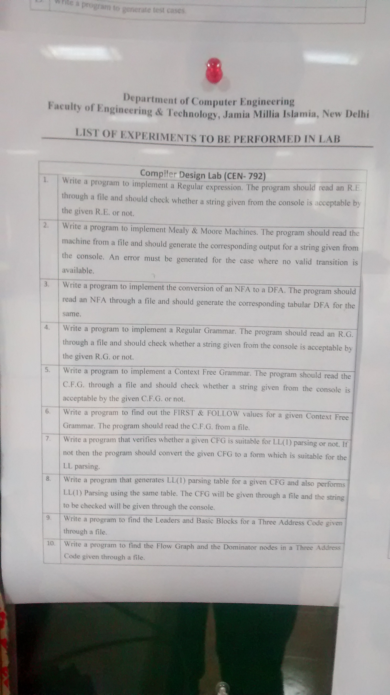
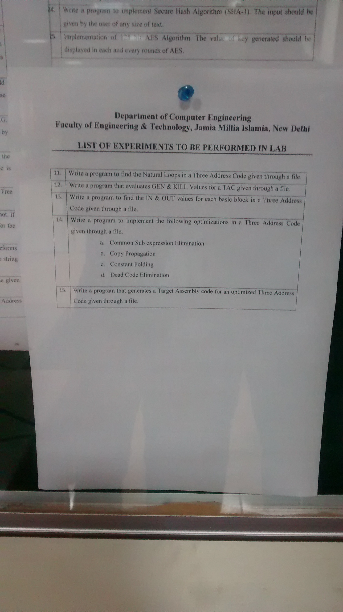

# CompilerLab
Compiler Lab

##Questions

1. Mealy Machine
2. Moore Machine
3. DFA acceptance
4. NFA to DFA conversion
5. Lexical Analyzer (question given to group 1)
6. DFA minimization (question given to group 2)

